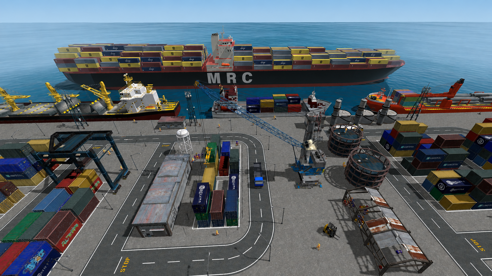

# Crane & Cargo



Interactive Graphics course — Sapienza University of Rome.

The game can be played here:

[Play Crane & Cargo](https://sapienzainteractivegraphicscourse.github.io/final-project-denata/)

The accompanying document (technical presentation and user manual) is here:

[Project documentation (PDF)](docs/project_documentation.pdf)

To run it locally:

```bash
npm install
npm run dev
```

Then open the address shown by Vite (usually `http://localhost:5173`). Wait for the loading screen to disappear.

---

## 1. What the project is

We built a small 3D harbor in the browser. The idea is simple: you work like a crane operator. A cargo ship docks, you pick containers with a portal crane, you stack them on the dock, and you can load them on a truck that leaves the port.

Around this core loop we added a full port scene: roads, buildings, decorative ships, workers, day and night lighting, fog, and physics when a container falls.

The project is not a scored game. There is no timer and no points. It is a playable sandbox. You can stay in the crane and move cargo, or you can walk around as a worker and look at the harbor.

Animations are written in JavaScript. We did not import ready-made animations from the models.

---

## 2. Environment used

The project runs in a web browser. The graphics API is **WebGL**.

We did not write raw WebGL shaders for the whole scene. We used **Three.js** (version 0.185). Three.js sits on top of WebGL and gives us a scene graph, cameras, lights, materials, loaders, and helpers. The renderer is `WebGLRenderer` with antialiasing. Shadows use `PCFSoftShadowMap`.

The page is plain HTML and CSS. The code is JavaScript ES modules. There is no React or Vue.

**Vite** (version 8) is the build tool. In development it serves the files. For GitHub Pages we use `npm run build`. The entry point is `index.html`, which loads `src/main.js`.

Each main object (ship, crane, truck, dock, worker) is a class with a `THREE.Group` called `root`. Moving that group moves the whole object. `main.js` creates the scene, handles keyboard input, and runs the game loop.

---

## 3. Libraries, tools and models not developed by the team

This section lists what we used but did not write ourselves.

### 3.1 Libraries and tools

| Name | Version | What we use it for |
|------|---------|--------------------|
| three | ^0.185.1 | 3D scene, renderer, lights, materials, GLB loading |
| @tweenjs/tween.js | ^25.0.0 | Smooth timed motion for the cargo ship, the truck, and decorative ships |
| cannon-es | ^0.20.0 | Physics for falling containers (Cannon.js for ES modules) |
| vite | ^8.2.1 | Dev server and production build |

Three.js add-ons (they come with Three.js, we did not write them):

- `GLTFLoader` — load `.glb` models
- `OrbitControls` — mouse orbit, pan and zoom
- `Water` — animated sea surface
- `BufferGeometryUtils` — merge road marking geometries

We also used Node.js and npm to install packages.

### 3.2 3D models (external)

We downloaded or found these models online. We scaled them, placed them, and animated them in code. We did not model them in Blender from scratch, and we did not import their animations.

**Gameplay objects**

| File | What we use it for | Source |
|------|--------------------|--------|
| `Crane_Modified3.glb` | Portal crane (named parts: boom, spreader, cables, wheels) | [Harbor Crane](https://sketchfab.com/3d-models/harbor-crane-d4d582ebd707426f93f1f5a9cdd0ce03) — MisterH |
| `trucks.glb` | Truck with wheels named FR, FL, RL, RR | [Trucks](https://sketchfab.com/3d-models/trucks-36ebb75f0a0549618a2b8a7ad26f9645) — FS 3D Studio |
| `simple_truck.glb` | Decorative road traffic (kei truck) | [Simple Kei Truck](https://sketchfab.com/3d-models/simple-kei-truck-fb477a6082c5442ca060dfcdf8eae928) — Spookyghostboo |
| `Worker.glb` | Walkable worker (skinned mesh, Mixamo-style bones) | [Pete](https://sketchfab.com/3d-models/pete-14cb64770751479094e2ca07fb5e4793) — drifter33 |
| `flashlight.glb` | Flashlight the worker can hold at night | [Flashlight](https://sketchfab.com/3d-models/flashlight-5fa9a65e7b0141ee877ed18f4f42d953) — MAR.COS. |
| `ships/ship_1.glb` | Playable cargo ship (first type) | [Cargo Ship 06 without containers](https://sketchfab.com/3d-models/cargo-ship-06-without-containers-c73ae6cc314941069a0e3a7ca6acc26d) — gogiart |
| `ships/ship_3.glb` | Playable cargo ship (second type) | [Multi-purpose Vessel VI](https://sketchfab.com/3d-models/multi-purpose-vessel-vi-5e9c300ee4be4bf698295516c8781527) — gogiart |
| `ships/deco/deco_ship_1.glb` | Background ship | [Ship AAA Re-upload](https://sketchfab.com/3d-models/ship-aaa-re-upload-0d869536fb064a288df36925e207c725) — gogiart |
| `ships/deco/deco_ship_2.glb` | Background ship | [Multi-purpose Vessel VII](https://sketchfab.com/3d-models/multi-purpose-vessel-vii-80aa5e7f2fab4abd9b3558a7411fdb98) — gogiart |
| `ships/deco/deco_ship_3.glb` | Background ship | [Container Ship](https://sketchfab.com/3d-models/container-ship-aaa41cca946b4a08bc08cf692b7757be) — RM02 |
| `ships/deco/deco_ship_4.glb` | Background ship | [Rescue Vessel](https://sketchfab.com/3d-models/rescue-vessel-f9815142cafc425090f98d329212b451) — gogiart |

**Containers** (picked at random, then scaled to the same size)

| File | What we use it for | Source |
|------|--------------------|--------|
| `20ft_container.glb` | Classic 20-foot container | [20ft Container](https://sketchfab.com/3d-models/20ft-container-c551a3eaeeb8431c9ec6e32181ed2c60) — dust_iny |
| `containers/cargo_container_new.glb` | Colored cargo containers | [Cargo Container](https://sketchfab.com/3d-models/cargo-container-82609a2050274620b5dd1e2098e17c73) — Satendra Saraswat |
| `containers/container.glb` | Extra container variant | [Container](https://sketchfab.com/3d-models/container-153c6b7ee8f94446b188b2c91259d714) — LiuMeowMeow |
| `containers/container_3d_model.glb` | Extra container variant | [Container 3D Model](https://sketchfab.com/3d-models/container-3d-model-32b50362e78b4145901b20b14f66911a) — Javier Martín Hidalgo |
| `containers/sea_cargo_container_-_legendarygamedev.glb` | Sea cargo container | [Sea Cargo Container](https://sketchfab.com/3d-models/sea-cargo-container-legendarygamedev-dec32c3dcc984ee79f914ebcd51bed44) — RienceCG |
| `containers/shipping_container.glb` | Shipping container | [Shipping Container](https://sketchfab.com/3d-models/shipping-container-429e58a328374df4921b8a12bc142b28) — Egor Gulyushkin |
| `containers/shipping_containers.glb` | Blue, green and red shipping containers | [Shipping containers](https://sketchfab.com/3d-models/shipping-containers-54ce322346904659acebd538b08a2b99) — ForevereQ |

**Environment and props**

| File | What we use it for | Source |
|------|--------------------|--------|
| `industrial_buildings_set_-_low_poly_models.glb` | Warehouses, tanks, power plant, silos and similar buildings | [Industrial Buildings Set - Low Poly Models](https://sketchfab.com/3d-models/industrial-buildings-set-low-poly-models-e0b0d0342be24e6c923319991a2a4d3d) — Daniel Zhabotinsky |
| `street_lamp.glb` | Street lamps along the roads | [Street Lamp](https://sketchfab.com/3d-models/street-lamp-d0f6ca0318c044d6a99ac5e376b8ceca) — StratoArt |
| `forklift_low_poly.glb` | Two parked forklifts | [Forklift Low Poly](https://sketchfab.com/3d-models/forklift-low-poly-8ab650b3982243f8b661142de50f79c9) — Ricardo Sanchez |
| `fuel_truck.glb` | Decorative fuel truck | [Fuel Truck](https://sketchfab.com/3d-models/fuel-truck-443da3cd0f4547c980e52168bfbe7b76) — simonthedigger |
| `docks_bollard.glb` | Mooring posts on the quay | [St Katharine Docks Bollard](https://sketchfab.com/3d-models/st-katharine-docks-bollard-c4c3548d6aab46c9ae40a2c86ea01c3f) — artfletch |
| `workers.glb` | Static worker poses around the yard | [Constructiin Worker 112](https://sketchfab.com/3d-models/constructiin-worker-112-7412a7866660423bbd74b48d82cb1ff9) — CloudHubOmniTeam |
| `damaged_chainlink_fence.glb` | Fence sections | [Damaged Chainlink Fence](https://sketchfab.com/3d-models/damaged-chainlink-fence-2de20806f13e42179db627d263901ff4) — Arsen Ismailov |
| `oil_barrel_opt.glb` | Oil barrel piles | [Collection of Oil Barrels](https://sketchfab.com/3d-models/collection-of-oil-barrels-a5dc16576c0944838e9bfe4e50e17735) — MisterH |
| `plastic_water_container_-_4mb.glb` | Plastic water containers | [Plastic Water Container](https://sketchfab.com/3d-models/plastic-water-container-4mb-15ded6bcefe147839a01d6730a77ab9d) — Mehdi Shahsavan |

### 3.3 Textures (external)

| File | What we use it for | Source |
|------|--------------------|--------|
| `textures/waternormals.jpg` | Normal map for the sea | [waternormals.jpg](https://github.com/mrdoob/three.js/blob/dev/examples/textures/waternormals.jpg) — Three.js |
| `textures/concrete/brushed_concrete_2_diff_2k.jpg` | Dock color (diffuse) | [Brushed Concrete 2](https://polyhaven.com/a/brushed_concrete_2) — Poly Haven |
| `textures/concrete/brushed_concrete_2_nor_gl_2k.jpg` | Dock normal map | [Brushed Concrete 2](https://polyhaven.com/a/brushed_concrete_2) — Poly Haven |
| `textures/concrete/brushed_concrete_2_rough_2k.jpg` | Dock roughness | [Brushed Concrete 2](https://polyhaven.com/a/brushed_concrete_2) — Poly Haven |
| `textures/concrete/quay_wall.png` | Vertical quay wall faces on the dock platform | AI generated |
| `textures/ground/asphalt_tile.png` | Road surface | AI generated |
| `textures/ground/dash_centerline_white.png` | White dashed center line on the roads | AI generated |
| `textures/ground/paint_stripe_white.png` | White road edges and yard slot lines | AI generated |
| `textures/ground/paint_stripe_orange.png` | Orange hatch markings in the crane zone | AI generated |
| `textures/ground/decal_manhole.png` | Manhole covers | AI generated |
| `textures/ground/decal_drain.png` | Storm drains | AI generated |
| `textures/ground/decal_patch.png` | Repair patches | AI generated |
| `textures/ground/decal_crack.png` | Pavement cracks | AI generated |
| `textures/ground/decal_pcrack.png` | Extra crack wear | AI generated |
| `textures/ground/decal_stop.png` | STOP markings | AI generated |
| `textures/ground/decal_arrow_white.png` | Direction arrows | AI generated |
| `textures/ground/decal_letter_d.png` | Depot letter D | AI generated |
| `textures/ground/decal_letter_y1.png` … `y5.png` | Yard labels Y1, Y3, Y4, Y5 | AI generated |
| `textures/ground/decal_dust.png` / `decal_dust_b.png` | Dust wear | AI generated |
| `textures/ground/decal_dirt.png` / `decal_dirt_b.png` | Dirt wear | AI generated |
| `textures/ground/decal_oil.png` | Oil stains | AI generated |
| `textures/ground/decal_fish.png` | Fish mark on the quay | AI generated |
| `textures/ground/decal_salt.png` | Salt wear | AI generated |
| `textures/ground/decal_net.png` | Net wear | AI generated |

Roads, the dock box, the sky dome and the fog walls are built in code with Three.js geometry. They are not imported models.

---

## 4. User manual

This section explains how to use the application.

### 4.1 First start

Open the GitHub Pages link or run the project locally. A dark loading screen appears while models and shaders load. When it says ready, you can play. Until then, keyboard and camera buttons are off.

The default camera is an overview of the working area. You can orbit with the left mouse button, zoom with the wheel, and pan with the right mouse button (when the current view allows it).

### 4.2 Screen layout

- **Top left:** list of main keys
- **Top center:** short prompts when an action is available, for example “Press E to load the container”
- **Top right:** Day / Night switch, and a Sunrise checkbox (only in day mode)
- **Bottom left:** camera buttons (views 1 to 7)

If a container blocks the truck road, a message appears: *Move the container blocking the road so the truck can pass.*

### 4.3 Crane and cargo

This is the main gameplay.

**Crane movement**

- **W / S** — raise / lower the boom
- **A / D** — rotate the upper body
- **Up / Down arrows** — move the crane along the dock
- **R / F** — raise / lower the spreader (the hook)

Hold a key to keep moving. If the spreader or the held container hits another container or the truck, that movement stops. Other keys can still work.

**Cargo**

- **E** — pick a container if the spreader is above it, or place the held container on the nearest free ship or depot slot
- **C** — load the held container onto the parked truck
- **Q** — drop the held container. It falls with physics.

To pick, the spreader must be above the box, not beside it, and there must be space to hang the container. If E does not appear, move the crane a bit.

### 4.4 Ship and truck

- **SPACE** — cargo ship arrives or leaves. You can only toggle when the ship is fully docked or fully gone. If a decorative ship is crossing, the game waits a few seconds so they do not overlap.
- **T** — truck arrives or leaves.

When you load the truck with C, or you pick the container that was on the truck, the truck leaves by itself after a short delay. When it comes back, there is a 20% chance it brings a new container.

If something is on the road, the truck waits. Move that container with the crane (or drop it somewhere else) and the truck continues.

### 4.5 Day, night and sunrise

Use the switch on the top right.

- **Day** — bright sky, sun shadows
- **Night** — dark sky, street lamps, crane lights, truck headlights. No sun shadows.
- **Sunrise** — only in day mode. Warmer light and a low sun.

### 4.6 Walking as a worker

Press 6 or 7.

- **Arrow keys** — walk and turn. You stay inside a limited part of the yard.
- **L** — flashlight, only at night.

Press 1–5 to go back to crane / overview cameras.

---

## 5. Implemented interactions (summary)

| Interaction | How |
|-------------|-----|
| Orbit / zoom / pan | Mouse, depending on camera view |
| Change viewpoint | Keys 1–7 or buttons |
| Day / night / sunrise | UI switches |
| Ship arrive / leave | SPACE |
| Truck arrive / leave | T (also auto after load) |
| Crane boom, rotate, travel, hoist | W S A D arrows R F |
| Pick / place container | E |
| Load truck | C |
| Drop container | Q |
| Walk as worker | arrows in views 6–7 |
| Flashlight | L at night in worker view |
| Truck waits if road is blocked | automatic, with a message |
| Containers fall and can knock stacks | Q and collisions |
| Contextual help | prompts when E or C is possible |

All of this is handled in JavaScript (keydown/keyup and the animation loop).

---